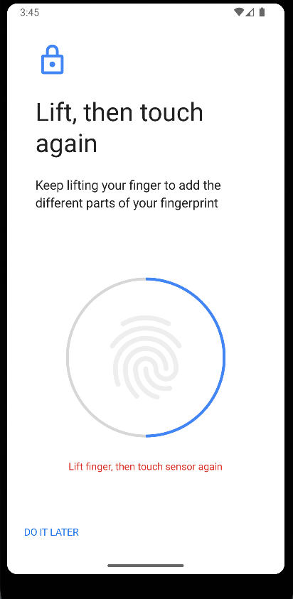
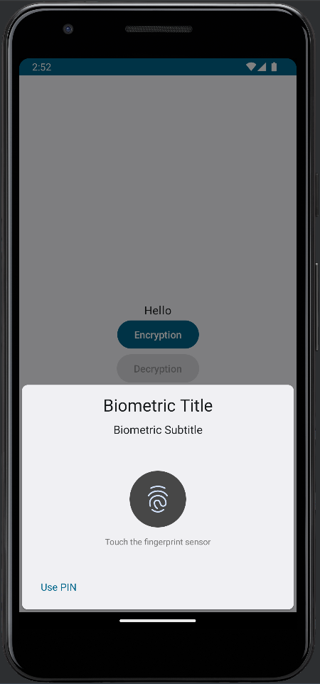

# SimpleBiometricDemo
I want to show how to use biometric features for encryption and decryption with Jetpack Compose. So, I made this repo.

You can use biometrics in the emulator if you want to enable fingerprinting at the emulator. There is one way to set it.

Go to set fingerprinting like a regular phone.



Use command:

```bash
 adb -e emu finger touch <number you want>
 //e.g., adb -e emu finger touch 10 
```
It can mock fingerprint recognition. Then, we can start writing code.

It needs to add some implementation at first.

```
    implementation("androidx.biometric:biometric:1.1.0")
    implementation("androidx.appcompat:appcompat:1.6.1")
```

Notice, Do not use the ``android.hardware.biometrics.BiometricPrompt``.
Instead, use the  ``androidx.biometric.BiometricPrompt``
It can make things a lot easier.

If you want to activate the biometric feature. You can write like this:

```kotlin
val executor = ContextCompat.getMainExecutor(this)
val activity: FragmentActivity = this
val biometricPrompt = BiometricPrompt(activity, executor,
    object : BiometricPrompt.AuthenticationCallback() {
        override fun onAuthenticationError(errorCode: Int, errString: CharSequence) {
            super.onAuthenticationError(errorCode, errString)
            Toast.makeText(activity.applicationContext, "error", Toast.LENGTH_SHORT).show()
        }

        override fun onAuthenticationSucceeded(result: BiometricPrompt.AuthenticationResult) {
            super.onAuthenticationSucceeded(result)
            Toast.makeText(activity.applicationContext, "succeeded!", Toast.LENGTH_LONG).show()
        }

        override fun onAuthenticationFailed() {
            super.onAuthenticationFailed()
            Toast.makeText(
                activity.applicationContext, "failed", Toast.LENGTH_LONG
            ).show()
        }
    }
)

val promptInfo = BiometricPrompt.PromptInfo.Builder()
    .setTitle("Biometric Title")
    .setSubtitle("Biometric Subtitle")
    .setAllowedAuthenticators(BIOMETRIC_STRONG or DEVICE_CREDENTIAL)
    .build()


biometricPrompt.authenticate(promptInfo)

```

It should be able to use biometrics (e.g., fingerprint.)


If it recognizes success. It should receive the message in method ``onAuthenticationSucceeded``

If you want to use biometrics for encryption/decryption. You must generate the secret key and the cipher init by that secret key.

```kotlin
val cipher = getCipher()
val secretKey = try {
    getSecretKey()
} catch (ex: Exception) {
    generateSecretKey(
        KeyGenParameterSpec.Builder(KEY_NAME, KeyProperties.PURPOSE_ENCRYPT or KeyProperties.PURPOSE_DECRYPT)
            .setBlockModes(KeyProperties.BLOCK_MODE_CBC)
            .setEncryptionPaddings(KeyProperties.ENCRYPTION_PADDING_PKCS7)
            .setUserAuthenticationRequired(true)
            .setInvalidatedByBiometricEnrollment(true)
            .build()
    )

    getSecretKey()
}

cipher.init(Cipher.ENCRYPT_MODE, secretKey)
biometricPrompt.authenticate(promptInfo, BiometricPrompt.CryptoObject(cipher))

```

Notice, Suggest enable the ``setUserAuthenticationRequired``. This will make this secret key only usable when user authentication. 

Then, you can get the processed cipher from ``onAuthenticationSucceeded`` when authentication is successful and use it to process encryption.

```kotlin
override fun onAuthenticationSucceeded(result: BiometricPrompt.AuthenticationResult) {
    super.onAuthenticationSucceeded(result)
    val encryptedInfo = result.cryptoObject?.cipher?.doFinal("text want to encrypt".toByteArray(Charset.defaultCharset()))
    // save this iv for decryption.
    saveIv(result.cryptoObject?.cipher?.iv)
}
```

If you want to decrypt the info that you just encrypt. You will need to generate a cipher for decrypt.

```kotlin
// The secret key use to encrypt info. and Iv that got from onAuthenticationSucceeded
cipher.init(Cipher.DECRYPT_MODE, secretKey, IvParameterSpec(iv.value))
```

And get processed cipher,You can process the decryption in ``onAuthenticationSucceeded``

```kotlin
override fun onAuthenticationSucceeded(result: BiometricPrompt.AuthenticationResult) {
    super.onAuthenticationSucceeded(result)
    val decryptedInfo: ByteArray? = result.cryptoObject?.cipher?.doFinal(encryptedInfo)
}
```